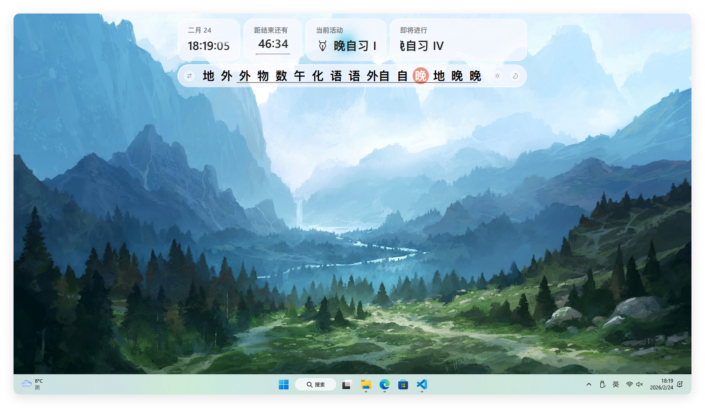
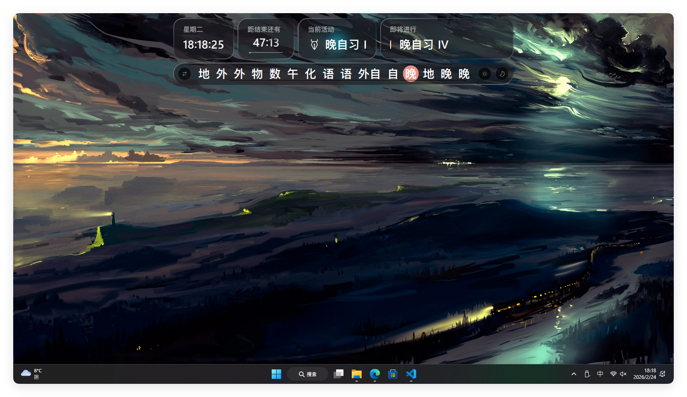

<h1>Lessons Displayer</h1>

看看今天有什么课？

<!----->

> [!IMPORTANT]
> 
> [原插件](https://github.com/Yersmagit/cw-lessons-displayer) 功能复杂，一些功能正逐步迁移，详见下方 __[功能迁移 / Functions](#功能迁移--functions)__ 板块。

## 介绍 / Introduction
可以完全展示当日课程信息，完全杜绝抄课表。
本插件
适用于 [Class Widgets 2](https://github.com/rinlit-233-shiroko/class-widgets-2) 。

_在寻找适用于 Class Widgets 1 的插件？请前往 旧版 [Lessons Displayer](https://github.com/Yersmagit/cw-lessons-displayer) 页面。_

### 截图 / Images

## 使用 / Usages
### 如何安装 / How to Install
1. 下载插件包

2. 在 Class Widgets 2 -> "设置" -> "插件"中导入下载好的插件包

### 使用方法 / How to Use
1. 在 Class Widgets 2 -> "设置" -> "插件"中启用

2. 重启软件

3. 完成！

## 功能迁移 / Functions
旧版插件的功能需要逐步迁移到 CW2，以下列举了已经或尚未迁移的功能。
- [x] 显示基本的胶囊状 UI 以显示课程列表
- [x] 基本 UI 跟随软件行为实时调整位置和宽度
- [ ] 熄屏模式和白板模式
- [ ] 自动化打开/关闭特定模式
- [ ] 自动化展示明日课程

## 致谢 / Acknowledgements
### 引用资源 / Credits
- [Class Widgets 2](https://github.com/rinlit-233-shiroko/class-widgets-2)
- [Class Widgets 2 SDK](https://github.com/Class-Widgets/class-widgets-sdk)
- [RinUI](https://ui.rinlit.cn/)

## 版权 / License
本项目基于 MIT 协议开源，详情请参阅 [LICENSE](https://github.com/rinlit-233-shiroko/class-widgets-2-plugin-template/blob/main/LICENSE) 文件。

The project is licensed under the MIT license. Please refer to the [LICENSE](https://github.com/rinlit-233-shiroko/class-widgets-2-plugin-template/blob/main/LICENSE) file for details.

