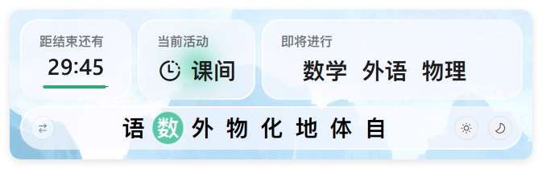
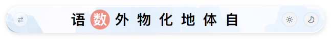
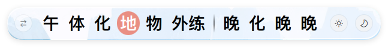
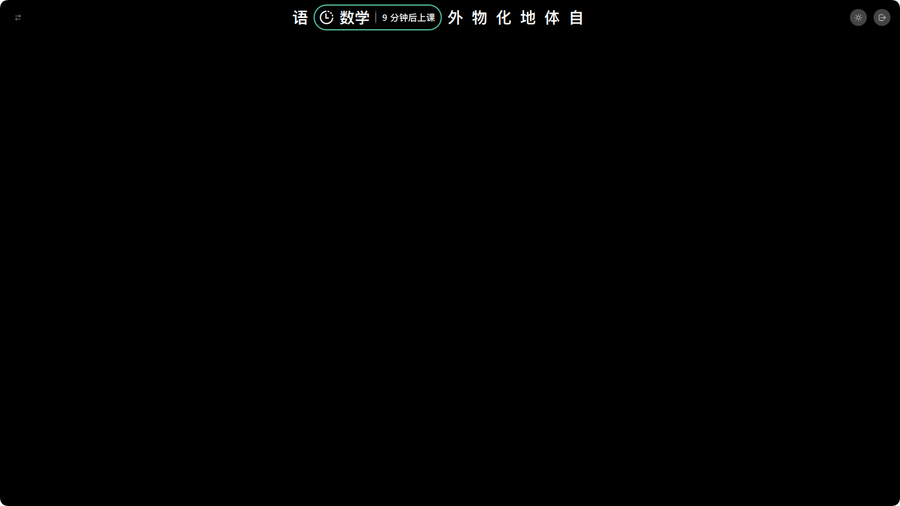

<h1>Lessons Displayer</h1>

看看今天有什么课？

<!----->

> [!IMPORTANT]
> 
> 按照计划，一些功能正逐步完善，详见下方 __📦 功能 / Functions__ 板块。

## 📖 简介 / Introduction
- 可以完全展示当日课程信息，完全杜绝抄课表。
本插件
适用于 [Class Widgets 2](https://github.com/rinlit-233-shiroko/class-widgets-2) 。

> [!TIP]
> 
> _在寻找适用于 Class Widgets 1 的插件？请前往 旧版 [Lessons Displayer](https://github.com/Yersmagit/cw-lessons-displayer) 页面。_

### ✨ 特性 / Features
- 显示当日课程信息
- 提供全屏白板模式和熄屏模式

## 📦 功能 / Functions
### 已有功能 / Existing Functions
#### 基本功能 / Basic Functions
- 软件运行时，自动显示当日课程信息。如图：
  

  
  

- 课程信息根据当前状态自动 **高亮** 显示。

  **上课** 时，**橙红色** 高亮显示正在上的课；**下课** 时，**绿色** 高亮显示下一节课。

  下图为数学课上课时的样子：
  

  
  

- 课程列表过长时，会 **自动** 将高亮课程滚动到胶囊形 UI 的中间偏左位置。如下图：
  

  
  

  当然，你也可以 **手动滚动课程列表**。支持 拖拽滚动 和 鼠标滚轮滚动。

  滚动条只在鼠标悬停或触控拖拽时显示。

- 在自由时间超过 15 分钟的位置，会显示一个 **分割线** 来分隔课程。如下图：
  

  
  

  *注：自由时间 指没有任何课程安排的时间段*

#### 更多功能 / More Functions
- 胶囊形 UI 右侧有 <strong>白板模式</strong> 按钮  和 <strong>熄屏模式</strong> 按钮 

  单击相应按钮可以打开相应模式。

- 白板模式或熄屏模式使用全屏纯色界面，只展示关键信息。有些类似于屏保。如下图：
  

  
  

  白板模式或熄屏模式下，高亮的课程会以胶囊形 **展开**，以显示更多详细信息。如下图：
  

  
  

- 白板模式或熄屏模式下，活动 **剩余时间** 会根据课程状态动态调整文本显示策略。

  如在上课时，会显示 `剩 x 分钟`；下课时，显示 `x 分钟后上课`。如果剩余时间少于 1 分钟，还会显示 `剩 x 秒` 或 `x 秒后上课`。

### 待开发功能 / Planned Functions

以下列举了本插件的待开发功能。
- [ ] 胶囊状 UI 跟随主程序的窗口标志和主题设置
- [ ] 插件的自定义设置
- [ ] 自动化展示明日课程

## 📥 安装 / Installation
### 如何安装并启用 / How to Install and Enable
1. 下载插件包

2. 在 Class Widgets 2 -> "设置" -> "插件"中导入下载好的插件包

3. 在 Class Widgets 2 -> "设置" -> "插件"中启用

4. 重启软件

5. 完成！

## ❤️ 致谢 / Acknowledgements
### 引用资源 / Credits
- [Class Widgets 2](https://github.com/rinlit-233-shiroko/class-widgets-2)
- [Class Widgets 2 SDK](https://github.com/Class-Widgets/class-widgets-sdk)
- [RinUI](https://ui.rinlit.cn/)

## ⚖️ 版权 / License
本项目基于 MIT 协议开源，详情请参阅 [LICENSE](https://github.com/rinlit-233-shiroko/class-widgets-2-plugin-template/blob/main/LICENSE) 文件。

The project is licensed under the MIT license. Please refer to the [LICENSE](https://github.com/rinlit-233-shiroko/class-widgets-2-plugin-template/blob/main/LICENSE) file for details.
