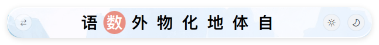
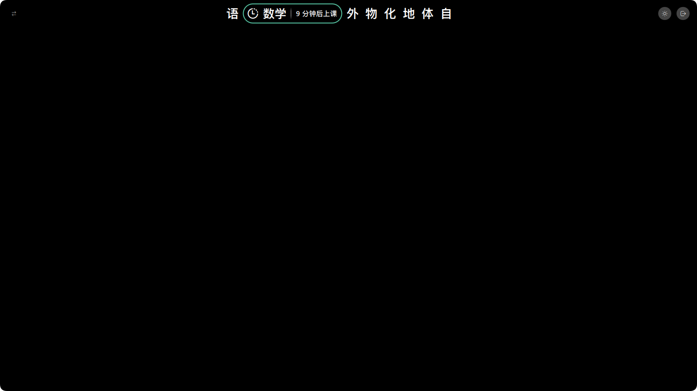
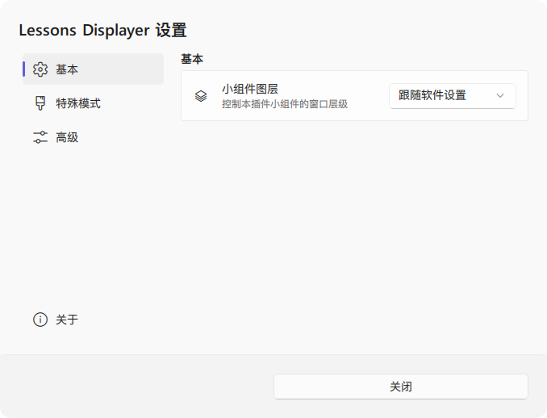

<h1>Lessons Displayer</h1>

看看今天有什么课？

<!----->

> [!TIP]
> 
> **插件现已更新到正式版！**

## 📖 简介 / Introduction
- 可以完全展示当日课程信息，完全杜绝抄课表。
本插件适用于 [Class Widgets 2](https://github.com/rinlit-233-shiroko/class-widgets-2) 。

### ✨ 特性 / Features
- 显示当日课程信息
- 提供全屏白板模式和熄屏模式

## 📦 功能 / Functions
### 主组件 / Main Widget
- 软件运行时，自动显示当日课程信息。
  

  
  

- 当前正在进行的课程或即将进行的课程会高亮显示，高亮颜色分别为橙红色和绿色。
  比如，数学课上课时，就是这样显示的：
  

  
  

- 在当日空闲时段，会自动显示一个 **分割线** 分隔课程。
  

  
  

  *注：需要空闲时段超过 15 分钟*

> [!TIP]
> 
> 课程列表支持滚动。同时，插件也会自动把重要内容滚动到左侧。

> [!IMPORTANT]
> 
> 未来，我们将在此小组件上展示更多内容。例如：明日课程、长通知、天气预警、集控相关信息等。

### 特殊模式 / Special Modes
- 小组件右侧，有 <strong>白板模式</strong> 按钮  和 <strong>熄屏模式</strong> 按钮 

  单击相应按钮以切换模式。

- 在白板模式或熄屏模式，只有关键信息被展示，界面全屏纯净，类似屏保。
  

  
  

  此时，当前课程的位置会显示更多信息。
  

  
  

### 设置页 / Settings
- 插件提供设置页，这里有更多你想要的功能！
  

  
  

> [!TIP]
> 
> 设置页打开方式：
> 1. 在小组件形态时，直接右键/长按小组件，打开右键菜单，选择“设置”。
> 2. 在熄屏/白板模式下，右键/长按屏幕上的任意位置，打开右键菜单，选择“设置”。

## 📥 安装 / Installation
### 如何安装并启用 / How to Install and Enable
1. 下载插件包

2. 在 Class Widgets 2 > "设置" > "插件"中导入下载好的插件包

3. 在 Class Widgets 2 > "设置" > "插件"中启用

4. 重启软件

5. 完成！

## 🤔 反馈 / Feedback

有功能建议或遇到问题？欢迎在 [GitHub Issues](https://github.com/Yersmagit/cw2-lessons-displayer/issues) 中指出！

## 📘 其它 / Others
### 引用资源 / Credits
- [Class Widgets 2](https://github.com/rinlit-233-shiroko/class-widgets-2)
- [Class Widgets 2 SDK](https://github.com/Class-Widgets/class-widgets-sdk)
- [RinUI](https://ui.rinlit.cn/)

### 版权 / License
本项目基于 MIT 协议开源，详情请参阅 [LICENSE](https://github.com/rinlit-233-shiroko/class-widgets-2-plugin-template/blob/main/LICENSE) 文件。

The project is licensed under the MIT license. Please refer to the [LICENSE](https://github.com/rinlit-233-shiroko/class-widgets-2-plugin-template/blob/main/LICENSE) file for details.
